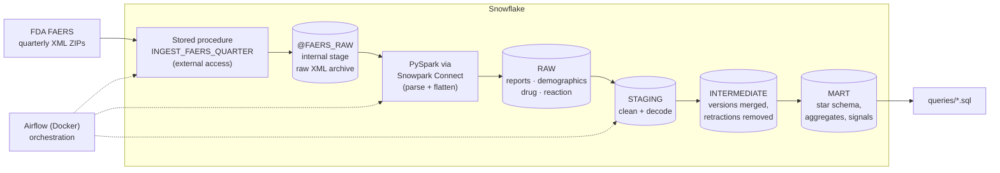

# Pharmacovigilance pipeline on FDA FAERS data

Pharmacovigilance teams, at drug manufacturers and at regulators, monitor
adverse event reports to spot potential drug safety hazards, follow trends in
what is being reported, and investigate individual cases. The FDA Adverse Event
Reporting System (FAERS) publishes every report it receives, about 1.4 million
a year, as quarterly XML exports: deeply nested, versioned, and hard to analyse
as they come.

This project ingests five years of FAERS (2021–2025, 7.2 million cases) into
Snowflake, models them into a star schema with dbt, adds a
disproportionality (PRR/ROR) signal screen, and answers a set of drug-safety
business questions with plain SQL in [`queries/`](queries/).

- **Ingestion runs entirely inside Snowflake.** A Python stored procedure
  downloads each quarter from FDA straight to an internal stage, and PySpark
  code parses the XML on warehouse compute through Snowpark Connect. Nothing is
  stored locally or in a third-party bucket.
- **dbt** turns raw reports into a star schema: cleaning and decoding, report
  version consolidation, retraction handling, and the fact and dimension tables
  the questions are asked against.
- **Airflow** (Docker Compose) orchestrates stage → load → dbt per quarter.

## Contents

- [Architecture](#architecture)
- [Data model](#data-model)
- [Running it](#running-it)
- [Repository layout](#repository-layout)
- [Business questions](#business-questions)
- [Findings](#findings)
- [Data quality decisions](#data-quality-decisions)
- [Limitations](#limitations)

## Architecture



1. **Stage** — `extraction.ingest_faers_quarter`
   ([`sprocs/ingest_faers_quarter.py`](src/faers_ingestion/sprocs/ingest_faers_quarter.py))
   is a Python stored procedure with an external access integration limited to
   `fis.fda.gov`. It streams a quarter's ZIP and writes each XML file to the
   `@FAERS_RAW` stage uncompressed, so the raw zone can be re-parsed without
   downloading from FDA again. It handles FDA's Deflate64-compressed quarters,
   which Python's `zipfile` cannot read, and logs every attempt to
   `EXTRACTION.INGESTION_LOG`.
2. **Load** — [`faers_ingestion.main`](src/faers_ingestion/main.py) runs PySpark
   DataFrame code on warehouse compute through Snowpark Connect for Spark: no
   local Spark, JVM or cluster. It reads the staged XML with a fixed schema
   ([`safetyreport_schema.json`](src/faers_ingestion/extract/safetyreport_schema.json)),
   first scanning each quarter for elements the schema doesn't know
   ([`schema_drift.py`](src/faers_ingestion/extract/schema_drift.py)), since FDA
   adds fields over time and an unknown element breaks the load with a
   misleading error. It then flattens the nested `safetyreport` into four RAW
   tables.
3. **Transform** — dbt ([`dbt/faers_transformations`](dbt/faers_transformations))
   builds staging → intermediate → marts, all as tables in their own schemas.
4. **Orchestrate** — [`faers_quarterly`](docker/airflow/dags/faers_quarterly.py)
   finds quarters not yet loaded, then stages and loads each one, and runs dbt
   through Cosmos with one Airflow task per model and its tests. The backfill
   goes through the same DAG, capped by a `max_quarters` parameter so an
   accidental trigger costs one quarter's credits. Airflow only issues
   commands; all compute is Snowflake's.

**Cost guardrails:** an XSMALL warehouse with 60-second auto-suspend, a
monthly resource monitor (`sql/04`), and a `faers_quarters` dbt var that
restricts a dev run to a single quarter.

## Data model

| Layer | Models | Job |
|---|---|---|
| Staging | `stg_reports`, `stg_demographics`, `stg_drugs`, `stg_reaction`, `stg_deleted_cases` | Rename, cast, decode FAERS codes into readable values through seed mappings (country, route, units, reaction groups) |
| Intermediate | `int_reports`, `int_demographics`, `int_drugs`, `int_reactions`, `int_linked_reports` | One row per report: consolidate versions, drop FDA retractions, resolve conflicting values; identify reports that share a case id |
| Marts: star | `fct_report`, `fct_report_drug`, `fct_report_reaction`, `dim_drug`, `dim_reaction`, `dim_date`, `dim_country` | The report is the spine (one row per case, linked duplicates collapsed); drugs and reactions hang off it at their own grain |
| Marts: signal | `brg_drug_reaction`, `mart_drug_reaction_signal` | Every implicated drug × every reaction on a report, and PRR / ROR / χ² with 95% CIs per pair |
| Marts: aggregates | `agg_drug_quarterly_trend`, `agg_expedited_drug_profile`, `agg_reaction_frequency`, `agg_outcome_trend`, `agg_patient_group_profile` | Pre-counted distinct reports per quarter for the trend questions |

The design reasoning, with the measurements behind each decision, is in
[`dbt/faers_transformations/models/README.md`](dbt/faers_transformations/models/README.md).
Model and column descriptions are pushed into Snowflake comments
(`persist_docs`), so they show up when browsing `MART` directly.

**Tests:** schema tests on keys and relationships, accepted values and ranges;
singular tests that cross-check the marts against each other (e.g. the four
contingency cells of every signal pair sum to the universe); dbt unit tests on
the trickiest logic (PRR/ROR math, dose-entry collapse, onset-age
normalization, the report version merge); a warning test for reaction terms
missing from the reaction-group seed; and pytest tests for the ingestion code
that runs without Snowflake (quarter parsing, config, the procedure's ZIP
handling). More in [`dbt/faers_transformations/README.md`](dbt/faers_transformations/README.md).

**CI** ([`.github/workflows/ci.yml`](.github/workflows/ci.yml)): ruff, pytest and
sqlfluff on `queries/` run on every push. `dbt build` on the 2020q1 slice, then
sqlfluff over the dbt project, runs on pull requests into `main` and on demand,
as a least-privilege `FAERS_CI` service user that can only read `RAW` and write
to `CI_STAGING`/`CI_INTERMEDIATE`/`CI_MART`, never the real layers.

## Running it

**Prerequisites:** a Snowflake account (the scripts assume a role that can
create a database, a warehouse and one external access integration), Python
3.12, and Docker if you want Airflow.

1. **Bootstrap Snowflake** by running the scripts in [`sql/`](sql/) in order in
   a worksheet: database, schemas, warehouse, resource monitor, then the stage,
   network rule, ingestion log and FDA external access integration (01–05).
   `06` creates the CI identity and is only needed for CI. All are idempotent.
2. **Configure** — copy `.env.example` to `.env` and fill in the account, user,
   role and path to a key-pair private key (key-pair auth only).
3. **Install:**
   ```bash
   python -m venv .venv && source .venv/bin/activate
   pip install -r requirements.txt -r requirements-dbt.txt && pip install -e .
   pip install -r requirements-dev.txt   # optional: ruff, sqlfluff, pytest
   ```
4. **Deploy the ingestion procedure, then stage and load a quarter:**
   ```bash
   python -m faers_ingestion.sprocs.deploy
   python -m faers_ingestion.main --quarters 2021q1 --ingest
   ```
5. **Build the warehouse:**
   ```bash
   cd dbt/faers_transformations
   dbt deps && dbt seed && dbt build
   ```
   For a quick dev run on one quarter: `dbt build --vars '{faers_quarters: [2020q1]}'`.
6. **Or run it all from Airflow:** fill in `docker/airflow/.env` from its
   example, then `docker compose up -d` in `docker/airflow/` and trigger
   `faers_quarterly` (raise `max_quarters` for a backfill).
7. **Answer the questions:** open any file in [`queries/`](queries/) in a
   Snowflake worksheet and run it.
8. **Checks:** `pytest`, `ruff check src test`, `sqlfluff lint queries/`, and
   `sqlfluff lint models tests analyses` from `dbt/faers_transformations`. For
   CI's dbt job, run `sql/06_create_ci_identity.sql` and add the GitHub secrets
   `SNOWFLAKE_ACCOUNT` and `FAERS_CI_PRIVATE_KEY` (the PEM text of the CI key).

## Repository layout

```
queries/                    business-question SQL, one file per question
src/faers_ingestion/
  sprocs/                   in-Snowflake download-and-stage procedure + deploy script
  extract/                  Snowpark Connect session, XML schema, drift check
  load/                     flatten to RAW tables, deleted-cases load
  main.py                   stage → load entry point
dbt/faers_transformations/
  models/staging|intermediate|marts
  models/README.md          modelling decisions and the measurements behind them
  seeds/                    code mappings (country, route, units, reaction groups)
  tests/                    cross-model consistency tests
  ci/                       dbt profile and sqlfluff config for CI
docker/airflow/             Airflow on Docker Compose + the quarterly DAG
sql/                        one-time Snowflake bootstrap scripts (06 = CI identity)
test/                       pytest tests for the ingestion package
.github/workflows/ci.yml    lint, tests, dbt build on the dev slice
```

**Stack:** Snowflake (stages, stored procedures, external access, Snowpark
Connect for Spark), PySpark, dbt Core + dbt-utils, Apache Airflow + Astronomer
Cosmos, Docker Compose, GitHub Actions, ruff, sqlfluff, pytest.

## Business questions

Each question has one query in [`queries/`](queries/). Every file runs as-is in
a Snowflake worksheet, reads only the `FAERS_DB.MART` schema, and sets its
parameters (analysis window, minimum counts, top N) as session variables at the
top, so they can be changed in one place. The header comment of each file says
how the query answers the question and which traps it avoids.

| # | Question | Query |
|---|---|---|
| | *Context: report volume per year* | [`00_report_volume_by_year.sql`](queries/00_report_volume_by_year.sql) |
| | **Unexpected reactions** | |
| 1 | Which drugs have the highest share of reports meeting the expedited criteria? | [`01_drugs_highest_expedited_share.sql`](queries/01_drugs_highest_expedited_share.sql) |
| 2 | What adverse reactions are reported in those cases? | [`02_reactions_in_expedited_reports.sql`](queries/02_reactions_in_expedited_reports.sql) |
| 3 | Which patient groups are most represented among expedited reports? | [`03_patient_groups_in_expedited_reports.sql`](queries/03_patient_groups_in_expedited_reports.sql) |
| 4 | Do unexpected reactions disproportionately occur in particular demographic groups? | [`04_expedited_rate_by_demographic_group.sql`](queries/04_expedited_rate_by_demographic_group.sql) |
| | **Serious reactions** | |
| 5 | Which drugs have the largest number of serious reactions? | [`05_drugs_most_serious_reports.sql`](queries/05_drugs_most_serious_reports.sql) |
| 6 | What are the most common outcomes for these reactions? | [`06_outcomes_of_serious_reactions.sql`](queries/06_outcomes_of_serious_reactions.sql) |
| | **5-year trends** | |
| 7 | Which drugs show a sustained increase in adverse-event reporting? | [`07_drugs_increasing_reporting.sql`](queries/07_drugs_increasing_reporting.sql) |
| 8 | Which drugs most frequently meet the expedited-reporting criteria? | [`08_drugs_most_often_expedited.sql`](queries/08_drugs_most_often_expedited.sql) |
| 9 | What are the most commonly reported adverse reactions? | [`09_most_common_reactions.sql`](queries/09_most_common_reactions.sql) |
| 10 | Which adverse reactions are becoming more frequently reported? | [`10_reactions_increasing_reporting.sql`](queries/10_reactions_increasing_reporting.sql) |
| 11 | Which outcome categories are growing? | [`11_outcome_trends.sql`](queries/11_outcome_trends.sql) |
| | **Signal detection** | |
| 12 | Which drug–reaction pairs are reported together far more often than chance predicts? | [`12_disproportionality_signals.sql`](queries/12_disproportionality_signals.sql) |

**Terms used throughout:**

- **Serious** — FDA's definition: the event led to death, a life-threatening
  condition, hospitalisation, disability, a congenital anomaly, or another
  medically important condition. Recorded per report, not per reaction.
- **Expedited** — a report a manufacturer had to send within 15 days because
  the event was both serious and *unexpected* (not described in the drug's
  label). This project uses it as the proxy for "unexpected reactions".
- **Implicated** — the reporter named the drug as *suspect* or *interacting*,
  as opposed to *concomitant* (something the patient was also taking). Drug
  rankings count implicated reports only, so that widely co-prescribed drugs
  don't top the lists on cases nobody suspects them of.

## Findings

Results as of **2026-09-29**, over reports received 2021Q1–2025Q4, after linked
duplicates are collapsed (see [Data quality decisions](#data-quality-decisions)).
Each table shows the top of the query's output; run the query for the full list.
These are counts of *reports*, which reflect reporting behaviour as much as drug
safety (see [Limitations](#limitations)).

### Context: report volume

| Year | Reports | Serious share | Expedited share |
|---|---:|---:|---:|
| 2021 | 1,555,925 | 64.1% | 55.6% |
| 2022 | 1,508,023 | 57.7% | 51.1% |
| 2023 | 1,365,632 | 55.6% | 53.1% |
| 2024 | 1,321,316 | 52.5% | 49.8% |
| 2025 | 1,369,840 | 55.2% | 50.7% |

Total volume fell about 12% from 2021 to 2025, so any drug or reaction that
grew did so against the tide.

### 1. Highest share of expedited reports

Drugs implicated in at least 1,000 reports:

| Product | Implicated reports | Expedited | Share |
|---|---:|---:|---:|
| Ranitidine capsule | 31,446 | 31,446 | 100% |
| Ranitidine hydrochloride (852) | 9,314 | 9,314 | 100% |
| Ranitidine hydrochloride (156) | 5,879 | 5,879 | 100% |
| Duodopa (carbidopa/levodopa) | 2,326 | 2,326 | 100% |
| Infliximab, recombinant | 1,048 | 1,048 | 100% |
| Phthalylsulfathiazole | 5,651 | 5,644 | 99.9% |
| Crysvita (burosumab) | 3,638 | 3,633 | 99.9% |
| Jakavi (ruxolitinib) | 1,127 | 1,126 | 99.9% |

The top of this list is not a ranking of dangerous drugs; it mostly reflects
*how* a drug's reports reach FDA. Ranitidine reports arrived in bulk during the
litigation after its 2020 withdrawal, and a share near 100% usually means
almost every report came through the manufacturer as a serious, unlabelled
case. Drugs with large patient-support programmes that also generate
non-serious reports, such as Humira (43%), sit far lower.

### 2. Reactions in expedited reports

| Reaction | Expedited reports | Share of expedited | Share of all | Over-representation |
|---|---:|---:|---:|---:|
| Death | 266,583 | 7.2% | 4.1% | 1.73 |
| Off label use | 248,783 | 6.7% | 6.1% | 1.10 |
| Drug ineffective | 180,311 | 4.9% | 6.3% | 0.77 |
| Fatigue | 137,324 | 3.7% | 3.8% | 0.98 |
| Nausea | 119,523 | 3.2% | 3.3% | 0.98 |
| Dyspnoea | 108,558 | 2.9% | 2.4% | 1.21 |
| Pneumonia | 84,075 | 2.3% | 1.5% | 1.56 |
| Pyrexia | 77,350 | 2.1% | 1.5% | 1.40 |
| Fall | 74,484 | 2.0% | 1.4% | 1.44 |

Expedited cases are mostly the same common reactions as all reports, but
death, pneumonia, falls and fever are markedly over-represented in them, while
"drug ineffective" and administration issues (such as a missed dose, at 0.53)
are under-represented: they are rarely serious.

### 3. Patient groups among expedited reports

| Age group | Share of expedited | Share of all | | Sex | Share of expedited | Share of all |
|---|---:|---:|---|---|---:|---:|
| Adult (18–64) | 36.9% | 34.7% | | Female | 46.6% | 49.4% |
| Elderly (65+) | 26.1% | 23.3% | | Male | 38.9% | 35.4% |
| Adolescent / child | 3.3% | 3.6% | | Not reported | 14.5% | 15.0% |
| Infant / neonate | 1.0% | 0.7% | | | | |
| Not reported | 32.6% | 37.6% | | | | |

Women file most reports overall, but men and the elderly make up a larger share
of the expedited ones than of all reports.

### 4. Expedited rate by demographic group

| Age group | Sex | Reports | Expedited rate | vs. all reports |
|---|---|---:|---:|---:|
| Infant | Female | 11,005 | 69.8% | 1.34× |
| Infant | Male | 13,720 | 68.3% | 1.31× |
| Elderly | Male | 731,651 | 63.3% | 1.21× |
| Adult | Male | 913,665 | 62.2% | 1.19× |
| Elderly | Female | 879,366 | 54.5% | 1.05× |
| Adult | Female | 1,472,755 | 51.6% | 0.99× |
| Child | Male | 67,303 | 47.0% | 0.90× |
| Child | Female | 53,123 | 46.5% | 0.89× |
| Adolescent | Male | 62,787 | 43.7% | 0.84× |

Yes: infants' reports are a third more likely to be expedited than the average
report, and men's are more likely than women's in every adult age band. This
compares reports with reports; FAERS has no population denominator, so it shows
which groups' reported cases skew towards serious-and-unexpected, not which
groups are at higher risk.

### 5. Drugs with the most serious reports

| Product | Serious reports (implicated) | Serious share | Deaths | Serious, as concomitant |
|---|---:|---:|---:|---:|
| Zantac (ranitidine) | 280,479 | 99.8% | 16,820 | 3,558 |
| Ranitidine | 127,409 | 99.7% | 8,759 | 6,893 |
| Humira (adalimumab) | 85,343 | 48.8% | 8,097 | 6,527 |
| OxyContin (oxycodone) | 80,529 | 98.0% | 6,528 | 2,556 |
| Prednisone | 76,559 | 92.5% | 11,778 | 90,775 |
| Methotrexate | 73,664 | 92.0% | 9,031 | 37,813 |
| Rituximab | 72,419 | 93.5% | 14,703 | 8,510 |
| Cyclophosphamide | 59,933 | 97.5% | 10,848 | 13,196 |
| Dexamethasone | 55,800 | 96.1% | 9,721 | 43,349 |
| Revlimid (lenalidomide) | 53,618 | 40.9% | 8,319 | 1,411 |

Ranitidine and, most likely, OxyContin rank on litigation-driven reporting. The rest are
immunosuppressants and cancer drugs, given to patients who are already very
ill. The last column shows why the role filter matters: prednisone appears on
more serious reports as a drug the patient was merely also taking than as a
suspect.

### 6. Outcomes of serious reactions

| Outcome | Share of serious-report reactions | Share of non-serious-report reactions |
|---|---:|---:|
| Fatal | 7.0% | 0.0% |
| Recovered with sequelae | 0.4% | 0.1% |
| Not recovered / not resolved | 15.9% | 12.2% |
| Recovering / resolving | 7.5% | 3.9% |
| Recovered / resolved | 14.5% | 9.7% |
| Unknown | 50.5% | 69.0% |
| Not reported | 4.2% | 5.0% |

Half of all reactions on serious reports have an unknown outcome; of those with
a known one, "not recovered" is the most common, and 7% are fatal.

### 7. Drugs with a sustained increase in reporting

Growth is the least-squares slope of quarterly reports over the 20 quarters,
divided by the average quarterly count (0.10 ≈ +10% of the average per
quarter), so steady growth ranks above a single spike. *Established* drugs had
at least 100 reports in 2021. Drugs below that, mostly launched during the
window, are ranked separately, since their growth is largely the launch itself.
Only drugs with at least 1,000 reports in the window are ranked.

| Cohort | Product | 2021 | 2025 | Growth / quarter |
|---|---|---:|---:|---:|
| Established | Tymlos (abaloparatide) | 223 | 5,981 | 0.204 |
| Established | Benralizumab | 136 | 2,128 | 0.199 |
| Established | Acalabrutinib | 162 | 1,864 | 0.163 |
| Established | Osimertinib | 433 | 3,449 | 0.150 |
| Established | Orgovyx (relugolix) | 365 | 11,853 | 0.144 |
| Established | Nubeqa (darolutamide) | 165 | 1,980 | 0.137 |
| Established | Wegovy (semaglutide) | 483 | 5,894 | 0.129 |
| Established | Depo-Provera (medroxyprogesterone) | 179 | 2,293 | 0.128 |
| New | Bimzelx (bimekizumab) | 0 | 8,439 | 0.264 |
| New | Nemluvio (nemolizumab) | 0 | 7,161 | 0.257 |
| New | Kisunla (donanemab) | 0 | 1,361 | 0.246 |
| New | Cobenfy (xanomeline/trospium) | 0 | 1,254 | 0.232 |
| New | Winrevair (sotatercept) | 0 | 2,046 | 0.229 |

The established list is mostly recent launches still ramping up (Orgovyx,
Nubeqa, Wegovy) and oncology drugs moving into wider use. Depo-Provera is the
exception: a decades-old drug whose reporting grew twelvefold after its
meningioma association was publicised (see question 10).

### 8. Drugs most often meeting the expedited criteria

| Product | Expedited reports (implicated) | Expedited share | 2021 | 2025 |
|---|---:|---:|---:|---:|
| Zantac (ranitidine) | 263,193 | 93.6% | 134,627 | 39 |
| Ranitidine | 124,906 | 97.8% | 95,899 | 593 |
| Prednisone | 75,147 | 90.7% | 14,467 | 17,012 |
| Humira (adalimumab) | 74,868 | 42.8% | 23,375 | 8,814 |
| Methotrexate | 73,591 | 91.9% | 15,699 | 12,610 |
| Rituximab | 71,377 | 92.2% | 12,323 | 15,483 |
| Cyclophosphamide | 58,195 | 94.7% | 8,750 | 12,722 |
| Skyrizi (risankizumab) | 42,339 | 63.3% | 3,183 | 15,271 |
| Rinvoq (upadacitinib) | 40,247 | 64.6% | 4,172 | 11,984 |

Expedited reports for Zantac and generic ranitidine together fell from about
230,000 in 2021 to about 630 in 2025 as the litigation wave passed. Humira's fell as biosimilars took its market,
while its successors in immunology, Skyrizi and Rinvoq, grew three- to
fivefold.

### 9. Most commonly reported reactions

| Reaction | Reports | Share of all reports | Serious share |
|---|---:|---:|---:|
| Drug ineffective | 447,223 | 6.3% | 40.7% |
| Off label use | 432,801 | 6.1% | 58.0% |
| Death | 295,011 | 4.1% | 99.3% |
| Fatigue | 268,087 | 3.8% | 53.9% |
| Pain | 237,644 | 3.3% | 68.3% |
| Nausea | 234,485 | 3.3% | 54.3% |
| Product dose omission issue | 223,502 | 3.1% | 26.9% |
| Diarrhoea | 219,790 | 3.1% | 56.4% |
| Headache | 183,726 | 2.6% | 51.3% |
| Dyspnoea | 171,574 | 2.4% | 69.9% |

The top of the list is not clinical at all: lack of effect, off-label use and
missed doses are MedDRA terms too, and FAERS records them as reactions.

### 10. Reactions with growing reporting

Growth is the least-squares slope of quarterly reports over the 20 quarters,
divided by the average quarterly count (0.10 ≈ +10% of the average per
quarter). *Established* reactions had at least 100 reports in 2021; the others
are ranked separately, since their growth is mostly their first appearance.

| Cohort | Reaction | 2021 | 2025 | Growth / quarter |
|---|---|---:|---:|---:|
| Established | Therapeutic response changed | 191 | 1,610 | 0.163 |
| Established | Meningioma | 171 | 1,775 | 0.155 |
| Established | Exposure via skin contact | 473 | 7,808 | 0.154 |
| Established | Drug diversion | 234 | 1,099 | 0.127 |
| Established | Dissociation | 344 | 2,079 | 0.115 |
| Established | Optic ischaemic neuropathy | 103 | 593 | 0.114 |
| Established | Impaired gastric emptying | 476 | 2,463 | 0.112 |
| Established | Dermatitis atopic | 3,799 | 15,831 | 0.103 |
| New | Rebound atopic dermatitis | 58 | 1,597 | 0.192 |
| New | Rebound eczema | 82 | 1,385 | 0.179 |
| New | Eosinophilic oesophagitis | 81 | 980 | 0.166 |
| New | Brain fog | 0 | 4,719 | 0.148 |

Most of these trace back to a handful of drugs; the one most often co-reported
with each reaction, from the signal mart:

- **Meningioma** — Depo-Provera (medroxyprogesterone), which gained a
  meningioma warning in 2024.
- **Impaired gastric emptying** and **optic ischaemic neuropathy** — GLP-1
  agonists (Ozempic, Wegovy, Mounjaro, Trulicity).
- **Therapeutic response changed** — Zepbound (tirzepatide).
- **Dissociation** — Spravato (esketamine nasal spray).
- **Rebound atopic dermatitis, rebound eczema, eosinophilic oesophagitis,
  exposure via skin contact** — Dupixent (dupilumab), whose reporting grew with
  its use.

### 11. Outcome trends

| Outcome | 2021 reactions | 2025 reactions | 2021 share | 2025 share | Growth / quarter |
|---|---:|---:|---:|---:|---:|
| Fatal | 181,082 | 253,826 | 4.2% | 5.9% | +0.023 |
| Recovering / resolving | 241,537 | 307,847 | 5.6% | 7.2% | +0.016 |
| Recovered / resolved | 551,138 | 572,501 | 12.7% | 13.3% | +0.002 |
| Unknown | 2,487,678 | 2,400,032 | 57.5% | 55.9% | −0.003 |
| Not recovered / not resolved | 641,137 | 587,255 | 14.8% | 13.7% | −0.008 |
| Not reported | 206,661 | 157,205 | 4.8% | 3.7% | −0.020 |

Fatal outcomes grew fastest, up 40% in count and from 4.2% to 5.9% of reactions
while total volume fell. Part of this is better outcome reporting: "not
reported" shrank over the same period.

### 12. Disproportionality signals

Pairs passing the Evans screen with at least 100 co-reported cases, where the
drug and the reaction each appear on at least 1,000 reports, ranked by the
lower bound of the PRR's 95% confidence interval:

| Product | Reaction | Cases | PRR | PRR lower 95% |
|---|---|---:|---:|---:|
| ParaGard (copper IUD) | Reproductive complication associated with device | 3,324 | 2,995,000 | 187,300 |
| ParaGard (copper IUD) | Foreign body in reproductive tract | 6,317 | 111,600 | 75,650 |
| Belantamab mafodotin | Keratopathy | 795 | 8,317 | 7,348 |
| Viread (tenofovir DF) | Skeletal injury | 7,173 | 5,498 | 5,094 |
| Elmiron (pentosan polysulfate) | Maculopathy | 1,291 | 5,476 | 4,982 |
| Depo-Provera | Meningioma | 1,613 | 2,755 | 2,578 |
| Oxbryta (voxelotor) | Sickle cell anaemia with crisis | 9,287 | 1,794 | 1,713 |

These are textbook: ParaGard arm breakage (the subject of litigation),
belantamab's boxed warning for corneal damage, tenofovir disoproxil's bone
toxicity, Elmiron's pigmentary maculopathy, Depo-Provera's meningioma warning
(2024), and Oxbryta, withdrawn worldwide in 2024 over vaso-occlusive crises and
deaths. PRRs this large mean the reaction is almost never reported *without*
the drug. Further down, a few pairs come from clusters of near-identical reports
(phthalylsulfathiazole, desoximetasone) rather than pharmacology.


## Data quality decisions

Things that looked like they needed cleaning but didn't, or that would silently
distort a count if handled naively:

- **Report versions are merged, not filtered.** A report is re-sent with each
  follow-up. The intermediate layer takes the latest *non-null* value per field
  across versions (`MAX_BY(field, IFF(field IS NOT NULL, version, NULL))`)
  rather than letting the latest row win, which would drop details a later
  follow-up left out.
- **FAERS's `duplicate` flag is not a duplicate marker, but the block can link
  duplicates.** Up to 2021Q3 it only restates the sender's own case number, on
  94% of reports, so filtering on it would delete almost everything. From
  2021Q4 it often carries *another* system's case id (a regulator's, a
  literature service's, another company's). Reports sharing one describe the
  same patient: in groups of 2–5, 99% agree on sex and 97% on age. Those
  groups are collapsed to their most recently received report, which removes
  82,548 duplicate reports (1.1%) from the window. FDA retractions (the
  deleted-cases file) are excluded too.
- **A drug is listed once per dose.** One report can list the same product
  dozens of times with different doses and dates, so every drug count here is
  `count(distinct report_id)`, never a count of rows.
- **Conflicting reaction outcomes resolve to the most severe.**
- **FAERS format drift.** From 2021Q4 the XML gained a new element and writes
  seriousness flags explicitly; before 2021Q4, 29% of product names end in a
  stray period (`PREDNISONE.`), which would split one drug into two and fake a
  jump in every drug trend. Both are handled: a drift check before each load,
  and a single trailing period stripped in `stg_drugs`.
- **Absent is not "unknown".** An empty sex field stays null, separate from a
  sender explicitly coding "unknown": merging them overstated that category
  about 500-fold.
- **Age group is derived where missing.** Senders fill FAERS's age-group field
  on only 29% of reports but give a numeric age on many more; queries 03 and 04
  derive the group from the normalised age using the ICH E2B bands, which cuts
  "not reported" from 71% to 37%.
- **The analysis window is set in receipt quarters.** `receipt_date` is the date
  of a report's *latest* follow-up, so MART also holds a few reports in 2026Q1–Q2.
  Those quarters would look like a collapse at the end of every trend, so the
  queries stop at 2025Q4.

## Limitations

- **Reports are not incidence.** FAERS is voluntary and stimulated reporting:
  media attention, litigation and new labelling all drive volume. Ranitidine
  (Zantac), withdrawn in 2020 over NDMA contamination and then the subject of
  mass litigation, dominates 2021's serious and expedited reports and nearly
  vanishes by 2025. There is no exposure denominator (how many people took
  the drug), so no rate here is a risk.
- **No drug-name normalisation.** `dim_drug` holds products as reported:
  "ZANTAC", "RANITIDINE" and "RANITIDINE CAPSULE" are separate rows, and no
  brand is mapped to its generic. This is the biggest limit on every "which
  drugs" answer; mapping to RxNorm would be a project of its own.
- **The signal screen is the simple one.** PRR/ROR with Evans criteria is the
  standard first-pass screen, but FDA uses Bayesian shrinkage (EBGM), which is
  far less prone to flagging small counts. A signal here means "worth a human
  look", not causation. Clusters of near-identical reports from one sender
  (phthalylsulfathiazole, desoximetasone) still produce implausible pairs.
- **Reaction groups are this project's own.** The custom reaction grouping was
  AI-assisted and manually reviewed, not MedDRA's official hierarchy (which is
  licensed); every reaction carries a `rule` / `fallback` flag saying how it was
  grouped.
- **Only linked duplicates are removed.** Reports that share a case id are
  collapsed (see above). The same event reported independently, with no shared
  id, still appears twice, as do all duplicates before 2021Q4, when FAERS's
  duplicate block linked nothing; catching those needs probabilistic matching
  on patient and event details.


